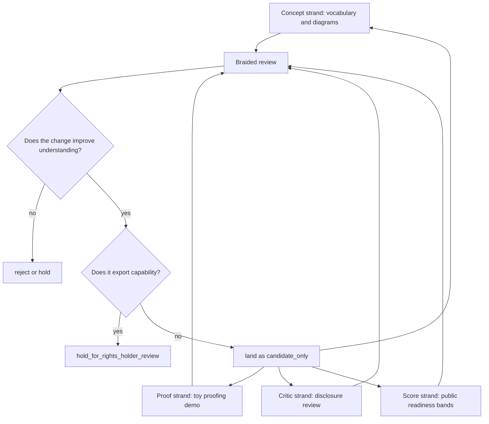
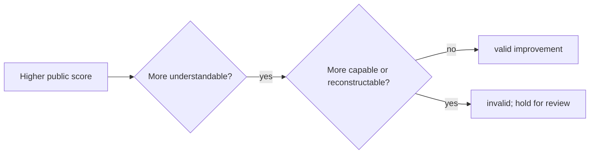

# Braided Development Loop

The braided development loop is the public v1 method for making Ontologica OS more coherent without exporting private machinery.

It is a public reviewer loop, not a private development process, production orchestration system, or scoring engine.

## Purpose

The loop answers:

> Can the public repository improve from structured-but-anemic to coherent-and-reviewable while preserving the anti-leak boundary?

## The Braid



## Strands

### 1. Concept Strand

Clarifies vocabulary, diagrams, and process shape.

Allowed public work:

- glossary entries
- Mermaid diagrams
- public boundary docs
- reviewer-facing explanations

Protected private work:

- private graph topology
- private scoring/ranking logic
- private routing logic
- private workspace topology

### 2. Proof Strand

Keeps the repository from becoming vaporware by maintaining a tiny proofing lane.

Allowed public work:

- synthetic fixtures
- toy projections
- synthetic manifests
- toy drift receipts
- proof packets
- promotion holds

Protected private work:

- production mathematical kernels
- real manifests
- real receipts
- private traces
- private promotion evidence

### 3. Critic Strand

Checks whether public artifacts stay inside the disclosure boundary.

Allowed public work:

- category-level critic receipts
- boundary assertions
- hold-for-review recommendations

Protected private work:

- private detectors
- private classification methods
- private threat models
- private leak telemetry

### 4. Score Strand

Creates a public qualitative scorecard for reviewer readiness.

Allowed public work:

- qualitative readiness bands
- before/after public-delta reports
- noncanonical score receipts

Protected private work:

- private eval corpora
- private benchmark scores
- private model performance metrics
- private cost, latency, or routing scores

## Public Score Bands

The score bands are qualitative public-readiness labels. They are not private metrics and not production evaluation results.

| Band | Label | Meaning |
| --- | --- | --- |
| 0 | absent | No public artifact exists. |
| 1 | skeletal | Structure exists, but the process is not demonstrable. |
| 2 | bounded | Boundaries are clear, but proof substance is thin. |
| 3 | coherent | A reviewer can follow a synthetic proof lane. |
| 4 | reviewable | The proof lane includes critic review and public scoring posture. |
| 5 | release-candidate | Manual release checklist and settings review are complete. |

## Two-Band Improvement Target

The v1 loop targets a two-band improvement:

```text
from: bounded
  to: reviewable
```

This is achieved by adding:

- proof packet anatomy
- disclosure critic loop
- workspace / policy shard boundary
- reviewer path
- public readiness scorecard

## Anti-Leak Rule

A score improvement is invalid if it makes the repository more reconstructable or production-useful.



## Completion Criteria

A braided loop is complete when:

- a public reviewer can state the product in one sentence
- a proof lane can be followed from fixture to hold decision
- a disclosure critic receipt exists
- a scorecard explains what improved
- every artifact remains synthetic, noncanonical, and candidate-only
- no private math, private scoring, private routing, real lineage, or production authority is exposed
