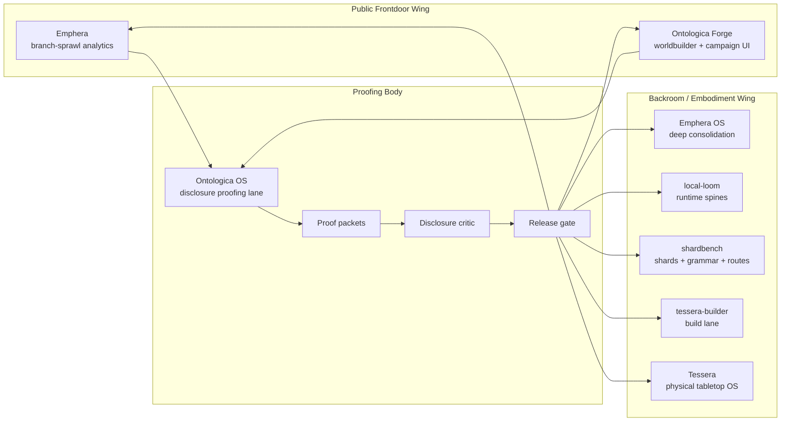
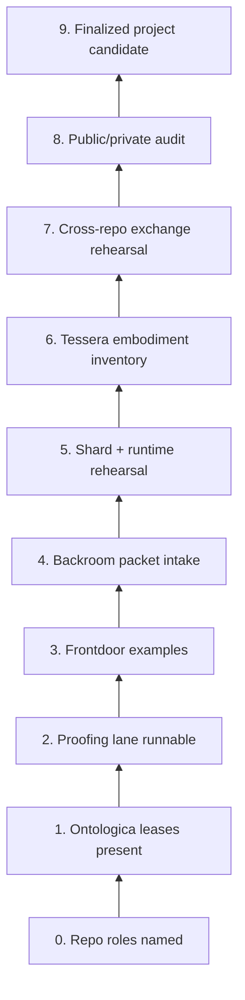
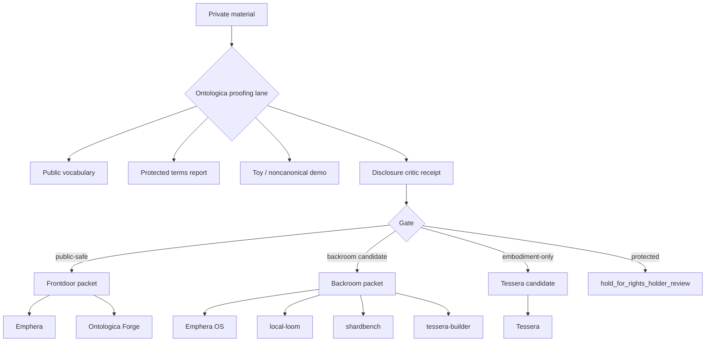

# Development Butterfly Maps

This document maps the project as a butterfly: public frontdoors on one wing, private/backroom kernels on the other, with Ontologica OS as the body that proofs movement between them.

It is a visual planning artifact, not production authority.

## Butterfly 1 — Ecosystem Body And Wings



## Butterfly 2 — Development Climb



## Butterfly 3 — Public And Private Artifact Movement



## Butterfly 4 — Milestone Wing Balance

The ecosystem should climb by keeping public and private wings balanced.

| Development band | Public wing | Backroom wing | Proofing body |
| --- | --- | --- | --- |
| Band 1 | Repo identity docs | Repo identity docs | Ontologica lease docs |
| Band 2 | Public-safe examples | Candidate intake docs | Proof packet scaffold |
| Band 3 | Frontdoor reviewer paths | Backroom intake packets | Disclosure critic receipts |
| Band 4 | Public demo packets | Runtime / shard rehearsals | Cross-repo exchange receipts |
| Band 5 | Release candidate surfaces | Production-adjacent candidates | Final boundary audit |

## Map Rules

1. Public wings cannot ingest private material directly.
2. Backroom wings cannot promote without human review.
3. Tessera-targeted movement cannot grant actuator or hardware authority from a public packet.
4. shardbench cannot become a hidden runtime promotion path.
5. local-loom cannot become uncontrolled execution machinery.
6. Ontologica OS remains the proofing body, not a production runtime.

## Final Butterfly Shape

```text
            Emphera                    Emphera OS
              \                         /
               \                       /
          Ontologica Forge -- Ontologica OS -- local-loom
               /                       \
              /                         \
       Public campaign frontdoor      shardbench / tessera-builder / Tessera
```

This is valid when every movement across the butterfly body leaves a proof packet, a disclosure critic receipt, and a human-reviewed gate decision.
