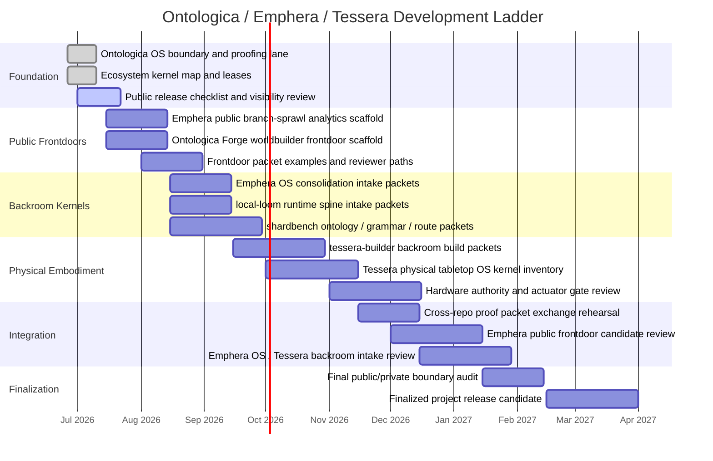

# Development Gantt Flow

This document provides a public planning scaffold for climbing from the current repository-kernel map toward a finalized project ecosystem.

It is a coordination artifact, not a production schedule, not a delivery promise, and not release authority.

## Roadmap Principle

Each milestone must preserve the kernel rule:

```text
Each repository is a kernel, not a dumping ground.
```

Every cross-repository movement requires:

```text
proof_packet: present
disclosure_critic: present
protected_terms_review: present
source_repository: declared
target_repository: declared
human_review: required
final_gate: hold / review / deny
```

## Milestone Gantt



## Milestone Ladder

### M0 — Ontologica OS boundary and proofing lane

Status: `done`

Outcome:

- proofing lane exists
- disclosure critic exists
- proof packet anatomy exists
- public/private boundary documents exist

### M1 — Ecosystem kernel map and leases

Status: `done`

Outcome:

- Emphera, Emphera OS, Ontologica Forge, tessera-builder, Tessera, local-loom, and shardbench have roles
- target repos lease Ontologica OS as proofing lane
- movement gates are defined

### M2 — Public release checklist and visibility review

Status: `active / human-gated`

Outcome:

- complete `PUBLIC_RELEASE_CHECKLIST.md`
- verify repo settings
- confirm no protected material is public
- confirm rights-holder approval

### M3 — Emphera public branch-sprawl analytics scaffold

Outcome:

- public branch-sprawl vocabulary
- public sprint consolidation report shape
- public dashboard concept
- no private merge/routing/scoring logic

### M4 — Ontologica Forge worldbuilder frontdoor scaffold

Outcome:

- shared worldbuilder landing page
- TTRPG-comfy UI concept path
- git campaign frontdoor packet shape
- no private campaign source corpus

### M5 — Frontdoor packet examples and reviewer paths

Outcome:

- public packet examples for Emphera and Ontologica Forge
- reviewer path for each frontdoor
- disclosure critic sample receipts

### M6 — Emphera OS consolidation intake packets

Outcome:

- private backroom intake packet shape
- consolidation candidate review path
- no production authority

### M7 — local-loom runtime spine intake packets

Outcome:

- runtime-spine candidate packet shape
- local orchestration posture docs
- no runtime authority

### M8 — shardbench ontology / grammar / route packets

Outcome:

- ontology shard packet shape
- grammar surface packet shape
- protected route-record packet shape
- scars and pearls ledger shape
- no canonical private shard store

### M9 — tessera-builder backroom build packets

Outcome:

- component preparation packet shape
- embodiment-kernel staging packet shape
- human-controlled Tessera movement gate

### M10 — Tessera physical tabletop OS kernel inventory

Outcome:

- private inventory of non-common embodiment kernels
- actuator governance categories
- component interface review posture
- no public hardware authority

### M11 — Hardware authority and actuator gate review

Outcome:

- hardware authority gates documented
- actuator decision states clarified
- public packet cannot grant action authority

### M12 — Cross-repo proof packet exchange rehearsal

Outcome:

- Ontologica proof packet moves between repos as a review object
- no automatic merge or promotion
- all receipts remain candidate-only

### M13 — Emphera public frontdoor candidate review

Outcome:

- first public-safe branch-sprawl consolidation candidate
- public analytics demo packet
- disclosure critic receipt

### M14 — Emphera OS / Tessera backroom intake review

Outcome:

- backroom candidate intake reports
- Tessera-targeted packet separation
- no frontdoor leakage

### M15 — Final public/private boundary audit

Outcome:

- inspect all public surfaces
- confirm no private machinery exposed
- confirm trivalent and embodiment boundaries still hold

### M16 — Finalized project release candidate

Outcome:

- public frontdoors are coherent
- backroom kernels are separated
- movement gates are enforced
- release remains human-approved

## Validity Rule

A milestone is valid only if it increases project clarity without increasing unauthorized capability export.

```text
understandability: may increase
private capability: must not export
release authority: human-gated
production authority: separately reviewed
```
