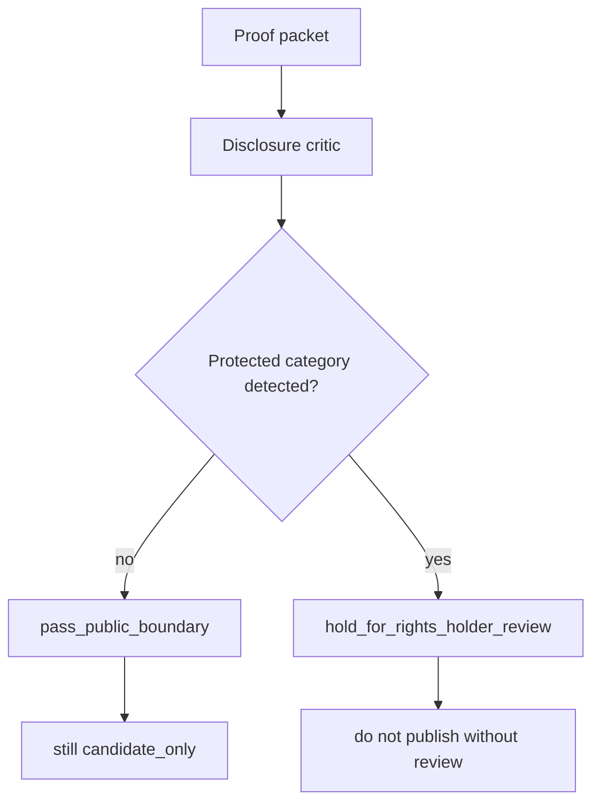
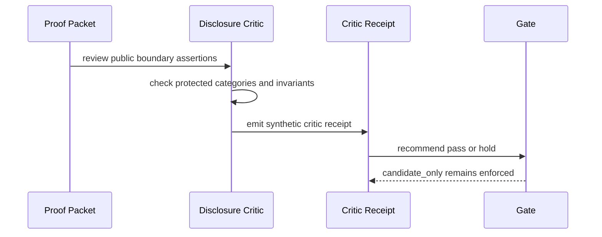

# Disclosure Critic Loop

The disclosure critic is the final public review loop in Ontologica OS.

It asks whether a public proof packet appears to expose protected categories or information that should remain undisclosed.

The critic is synthetic, deterministic, noncanonical, and candidate-only. It is not an LLM call and not a security product.

## Purpose

The critic answers one question:

> Does this public artifact stay inside the source-visible boundary, or should it be held for rights-holder review?

## Public Flow



## Protected Categories

The critic treats the following as categories that should remain undisclosed unless the rights holder explicitly approves them:

- private mathematical kernel
- private analysis core
- private scoring or ranking
- private model routing
- private receipt graph
- real manifest lineage
- private runtime authority
- private hardware authority
- private workspace topology
- production policy engine

These are categories, not detection algorithms. The public repo must not include private detectors or internal classification machinery.

## Critic Invariants

The critic checks public invariants:

```text
authority_ceiling: candidate_only
status: noncanonical or candidate_only
gate_decision: hold_for_review or deny
implementation_rights: not granted
```

If an invariant fails, the critic returns:

```text
hold_for_rights_holder_review
```

## What the Critic May Say

Allowed:

- this packet appears to stay inside public boundary
- this packet should be held for rights-holder review
- these protected categories should stay private
- this artifact is candidate-only
- this artifact does not grant implementation rights

Not allowed:

- private scoring/routing details
- private mathematical details
- private thresholds or dimensions
- private receipt graph layout
- private workspace topology
- private model assignment logic
- real lineage or production manifests

## Sequence



## Default Rule

When uncertain, the critic must choose:

```text
decision: hold_for_rights_holder_review
authority_ceiling: candidate_only
reason: public repository must explain invariants without exporting capability
```

## Current Demo Output

The proofing demo writes:

```text
sample_outputs/proofing_demo/disclosure_critic_receipt.json
```

That receipt is a public review artifact. It does not grant publication, implementation, runtime, or durable-truth authority.
