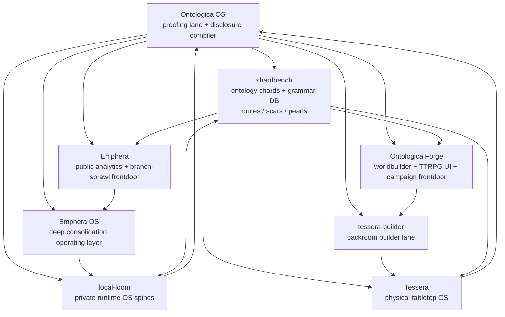

# Ecosystem Kernel Map

This document hardens the current GitHub landing-zone strategy across Ontologica OS, Emphera, Emphera OS, Ontologica Forge, tessera-builder, Tessera, local-loom, and shardbench.

The map is a public-facing coordination surface. It is not a production architecture, not private routing logic, and not a grant of authority between repositories.

## Core Direction

The system direction is valid because each repository has a narrow kernel role:

```text
Ontologica OS
  decides what can be safely said or moved

Emphera
  public analysis and branch-sprawl consolidation frontdoor

Emphera OS
  deeper consolidation operating layer

Ontologica Forge
  shared worldbuilder, TTRPG-comfy UI, and git campaign frontdoor

tessera-builder
  backroom builder lane for Tessera-targeted work

Tessera
  physical tabletop OS and embodied-kernel target

local-loom
  private runtime OS spine lane

shardbench
  ontology shard, grammar DB, route, scar, and pearl workbench
```

## Mermaid Map



## Kernel Roles

| Repository | Kernel role | Public-facing posture | Primary hold boundary |
| --- | --- | --- | --- |
| Ontologica OS | Disclosure proofing lane | Source-visible public proof language | No production authority |
| Emphera | Branch-sprawl and analytics frontdoor | Public | No private sprint or merge machinery |
| Emphera OS | Deeper consolidation OS | Backroom / production-adjacent candidate | No production authority without separate gate |
| Ontologica Forge | Worldbuilder and campaign frontdoor | Public-safe frontdoor | No private campaign, hardware, or runtime internals |
| tessera-builder | Tessera preparation lane | Backroom builder lane | No actuator or physical control authority |
| Tessera | Physical tabletop OS | Controlled embodiment lane | No public packet grants hardware authority |
| local-loom | Runtime OS spine lane | Private runtime-spine lane | No uncontrolled runtime execution |
| shardbench | Ontology shard and grammar workbench | Controlled shard-storage lane | No private canonical shard store or runtime promotion |

## Why This Is A Good Direction

### 1. Separation of concerns

Analysis, worldbuilding, physical embodiment, runtime spines, and shard storage are separated instead of crowded into one repository.

### 2. Lower leakage risk

Ontologica OS acts as the proofing lane before material moves to frontdoor or backroom targets.

### 3. Clear public/private split

Emphera and Ontologica Forge can be public frontdoors, while Tessera, local-loom, shardbench, and Emphera OS can preserve controlled backroom authority.

### 4. Better consolidation mechanics

Complex sprint output can be packetized and routed by target instead of merged directly into a monolithic system.

### 5. Stronger future development cycles

Untapped modules can be activated later by assigning each one a kernel role, Ontologica lease, and movement gate.

## Known Risks

| Risk | Mitigation |
| --- | --- |
| Repository sprawl | Every repo must have a narrow kernel role and Ontologica lease. |
| Public/private confusion | Every movement requires proof packet, disclosure critic, and human review. |
| Duplicate docs | Central strategy docs should be treated as maps, while each repo owns its own README. |
| Premature production claims | All new repos default to `candidate_only`, no production authority. |
| Embodiment leakage | Tessera and tessera-builder explicitly block hardware authority from public packets. |

## Required Gate For Cross-Repo Movement

```text
proof_packet: present
disclosure_critic: present
protected_terms_review: present
source_repository: declared
target_repository: declared
human_review: required
final_gate: hold / review / deny
```

## Validation Decision

```text
direction: valid
confidence: high
release_authority: not granted
production_authority: not granted
next_gate: human review and repo-specific implementation planning
```

## Strategy Rule

Each repository should become a kernel, not a dumping ground.

A repository is valid when it can answer:

1. What is my kernel role?
2. What belongs here?
3. What must not land here?
4. What proof packet is required for incoming material?
5. What authority is explicitly not granted?
