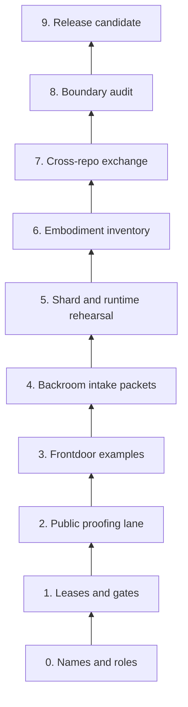

# Finalization Ladder

This document turns the Gantt flow and butterfly maps into a ladder of concrete gates.

Each rung must be completed with evidence before the ecosystem should claim progress toward a finalized project.

## Ladder Overview



## Rung 0 — Names and roles

Evidence required:

- each repository has a README
- each repository states its kernel role
- each repository states what must not land there

Current target repos:

```text
ontologica_os
emphera
emphera-os
Ontologica-Forge
tessera-builder
tessera
local-loom
shardbench
```

## Rung 1 — Leases and gates

Evidence required:

- each target repo has an Ontologica lease or equivalent intake rule
- every lease requires proof packet, disclosure critic, protected terms review, human review, and final hold/review/deny gate

## Rung 2 — Public proofing lane

Evidence required:

- runnable proofing demo
- proof packet anatomy
- disclosure critic receipt
- promotion report ending in `hold_for_review`

## Rung 3 — Frontdoor examples

Evidence required:

- Emphera public analytics / branch-sprawl packet example
- Ontologica Forge worldbuilder / campaign packet example
- no private source or runtime material

## Rung 4 — Backroom intake packets

Evidence required:

- Emphera OS intake packet example
- local-loom runtime-spine intake packet example
- tessera-builder build packet example
- all default to `candidate_only`

## Rung 5 — Shard and runtime rehearsal

Evidence required:

- shardbench ontology-shard packet
- grammar surface packet
- route / scar / pearl packet
- local-loom runtime-spine packet
- cross-check that no automatic runtime promotion is granted

## Rung 6 — Embodiment inventory

Evidence required:

- Tessera physical tabletop OS kernel inventory
- actuator governance categories
- physical component boundary docs
- proof that no public packet grants hardware authority

## Rung 7 — Cross-repo exchange rehearsal

Evidence required:

- one synthetic packet routes from Ontologica OS to Emphera
- one synthetic packet routes from Ontologica OS to Ontologica Forge
- one synthetic packet routes from Ontologica OS to local-loom or shardbench
- one synthetic packet routes toward tessera-builder or Tessera but stays held for human review

## Rung 8 — Boundary audit

Evidence required:

- public/private audit receipt
- no private math, routing, scoring, lineage, manifests, receipts, branch topology, hardware paths, or actuator authority exposed
- trivalent and embodiment hard-hold boundaries checked

## Rung 9 — Finalized project release candidate

Evidence required:

- frontdoors are coherent
- backroom lanes are separated
- movement gates are exercised
- public surfaces are reviewable
- production authority remains separately gated
- human release approval is recorded

## Progress Rule

A rung is complete only when it has a receipt or committed artifact.

A rung is not complete because a conversation says it is complete.

## Current Assessment

```text
current_rung: 2
label: public proofing lane established
next_rung: 3
next_focus: frontdoor packet examples for Emphera and Ontologica Forge
release_authority: not granted
production_authority: not granted
```

## Finalization Definition

The project is finalized when public frontdoors, backroom kernels, shard/runtime lanes, and physical embodiment lanes all exchange governed packets through Ontologica OS without leaking protected machinery or granting unintended authority.
