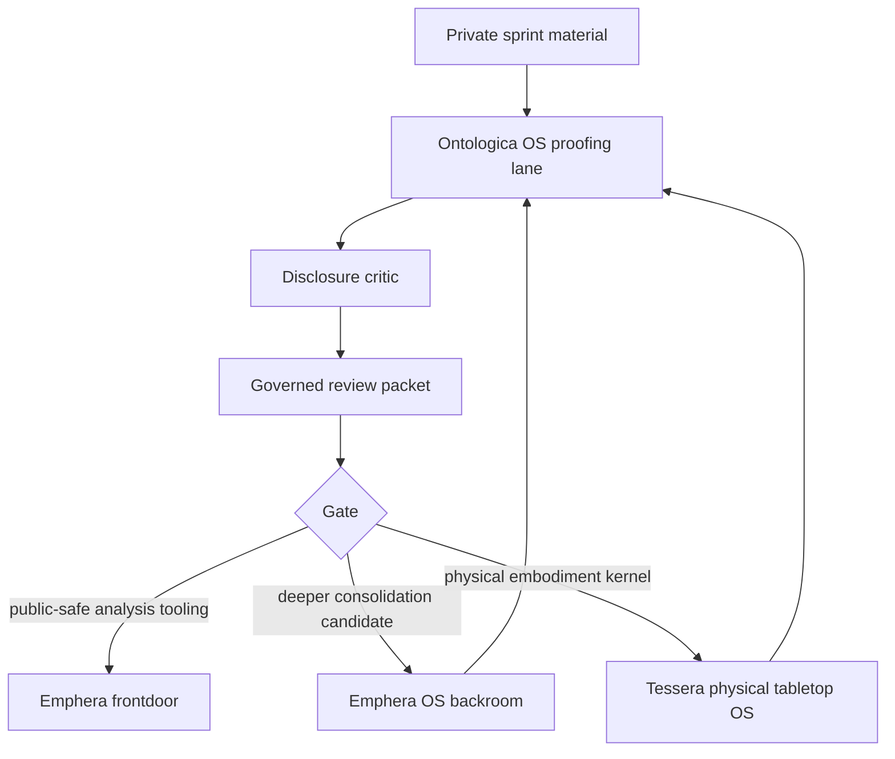

# Frontdoor / Backroom Framework

The frontdoor / backroom framework defines how Ontologica OS, Emphera, Emphera OS, Tessera, and future private consolidation work should relate.

## Core Distinction

```text
frontdoor
  public explanation surface
  public review packets
  public diagrams
  public noncanonical artifacts
  public-safe release posture

backroom
  private consolidation work
  private sprint material
  private source history
  private implementation details
  private tooling migration
  private production hardening
  physical embodiment hardening
```

## Repository Roles

### Ontologica OS

Ontologica OS is the proofing lane.

It exists to classify, bound, and receipt public-facing explanation packets before any material moves toward a public frontdoor or a private backroom target.

Default posture:

```text
authority_ceiling: candidate_only
decision: hold_for_review
```

### Emphera

Emphera is the public frontdoor for complex agentic branch-sprawl consolidation and general data-analytics tooling.

It should start public and become the place where cleaned, bounded, public-safe consolidation and analysis tooling can be presented.

Default posture:

```text
public_frontdoor: true
production_claim: only after explicit review
```

### Emphera OS

Emphera OS is the deeper operating layer for consolidation workflows.

It may receive candidate concepts from Ontologica OS and public-facing surfaces from Emphera, but production authority remains human-controlled.

Default posture:

```text
backroom_candidate: true
human_controlled_intake: true
```

### Tessera

Tessera is the physical tabletop OS target.

It is the home for non-common embodiment kernels, actuator governance, component-specific control surfaces, and hardware-adjacent proof posture.

Default posture:

```text
physical_tabletop_os: true
public_frontdoor: false
hardware_authority: gated
human_controlled_intake: true
```

## Conceptual Flow



## Frontdoor Rules

A frontdoor artifact may contain:

- public vocabulary
- public diagrams
- synthetic examples
- review packets
- noncanonical demonstrations
- release notes
- public-safe tooling concepts

A frontdoor artifact must not contain:

- private source code
- private implementation history
- private routing
- private scoring
- private branch/worktree topology
- real private manifests
- real private receipts
- private production release process
- hardware authority paths
- actuator control logic
- physical embodiment kernels

## Backroom Rules

Backroom work may consolidate serious tooling from private systems only under human review.

Backroom work remains outside this public repository until transformed into a public-safe packet.

Tessera-targeted backroom work remains physically embodied and authority-sensitive. It should not be exposed through public Emphera surfaces without an Ontologica proof packet and explicit human review.

## Product Position

Emphera targets an underdeveloped space:

> complex agentic branch-sprawl consolidation and general data-analytics tooling.

Tessera targets a different space:

> the physical tabletop OS for non-common embodiment kernels and actuator-governed components.

Ontologica OS validates what can be safely said and moved toward either frontdoor or backroom target.

## Release Gate

All movement from backroom to frontdoor, or from proofing lane to target repository, requires:

```text
proof_packet: present
disclosure_critic: present
protected_terms_review: present
target_repository: declared
human_review: required
final_gate: hold / review / deny
```
