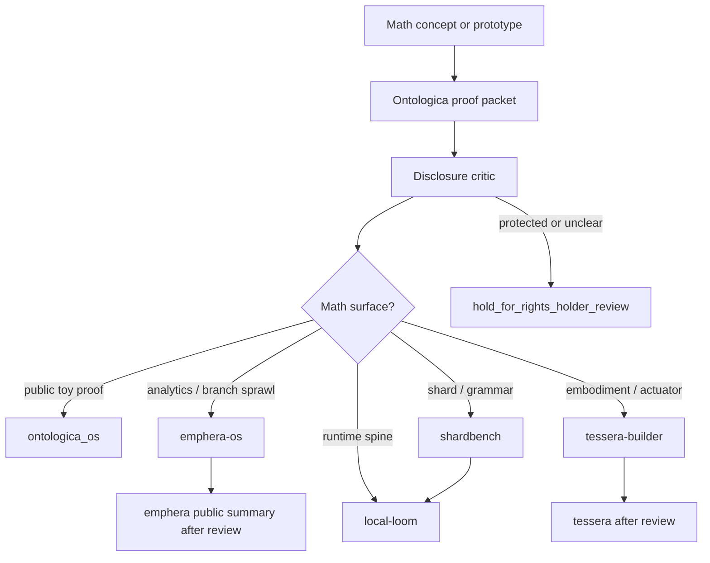

# Math Engine Landing Policy

This document defines where mathematical-engine work belongs in the repository ecosystem.

It is a routing policy and disclosure boundary. It is not a production implementation, not a math specification, and not release authority.

## Core Decision

The real math engine must not land in public Ontologica OS.

Ontologica OS may keep only toy, synthetic, noncanonical math surfaces that explain proof posture. Production-capable math belongs in backroom target repositories under human review.

## Repository Targets

| Math surface | Landing target | Reason | Public posture |
| --- | --- | --- | --- |
| Toy proof projection | `ontologica_os` | Explains disclosure proofing flow | synthetic, candidate-only |
| Branch-sprawl / analytics math | `emphera-os` first, then public summaries in `emphera` | Analysis-core and consolidation behavior need backroom hardening before public frontdoor | private/backroom until reviewed |
| Runtime-spine math | `local-loom` | Runtime motion, scheduling, or orchestration-adjacent math must stay off public frontdoors | private runtime-spine candidate |
| Ontology shard / grammar math | `shardbench` | Shard, grammar, route, scar, and pearl surfaces need storage/review before runtime or public use | controlled shard workbench |
| Embodiment / actuator math | `tessera-builder` first, then `tessera` | Physical embodiment and actuator-adjacent math needs extra gate discipline | no public hardware authority |
| Worldbuilder presentation math | `Ontologica-Forge` only as public-safe derived examples | Frontdoor explanation, not engine logic | public-safe examples only |
| Public analytics display | `emphera` only as aggregated, public-safe dashboards or reports | Public frontdoor should show outputs, not protected machinery | public-safe summaries only |

## How To Land The Real Math Engine

The correct landing path is staged:

```text
private concept or prototype
  -> Ontologica OS proof packet
  -> disclosure critic
  -> protected terms review
  -> target selection
  -> backroom candidate repository
  -> human review
  -> frontdoor summary only if safe
```

## Recommended First Target

For general analysis and branch-sprawl consolidation math:

```text
primary_target: emphera-os
frontdoor_summary_target: emphera
```

For runtime-spine math:

```text
primary_target: local-loom
frontdoor_summary_target: none until reviewed
```

For ontology shard and grammar math:

```text
primary_target: shardbench
runtime_target: local-loom only after review
```

For physical embodiment math:

```text
primary_target: tessera-builder
final_target: tessera
public_frontdoor: none unless reduced to public-safe explanation packet
```

## Landing Packet Required

Any real math-engine work must arrive as a governed packet:

```text
proof_packet: present
disclosure_critic: present
protected_terms_review: present
source_repository: declared
target_repository: declared
math_surface: declared
human_review: required
final_gate: hold / review / deny
```

## Protected Material

Do not land the following in public frontdoors or public Ontologica OS:

- private dimensions
- private field semantics
- real constants, weights, or thresholds
- private scoring or ranking logic
- private tensor layouts
- private correlation logic
- production validators
- runtime authority
- actuator or hardware authority
- real manifests
- real SHA lineage
- real receipts
- private traces

## Allowed Public Math

Public math may only be:

- toy
- synthetic
- noncanonical
- candidate-only
- explanatory
- not reusable as production machinery

## Mermaid Routing Map



## Default Decision

When uncertain:

```text
decision: hold_for_rights_holder_review
authority_ceiling: candidate_only
reason: math-engine work can become reconstructable capability
```

## Good Direction Test

A math-engine landing is valid when it improves system organization without moving private capability into public frontdoors.

It is invalid if it makes Ontologica OS, Emphera, or Ontologica Forge reconstruct private math, private scoring, private routing, runtime authority, or actuator behavior.
