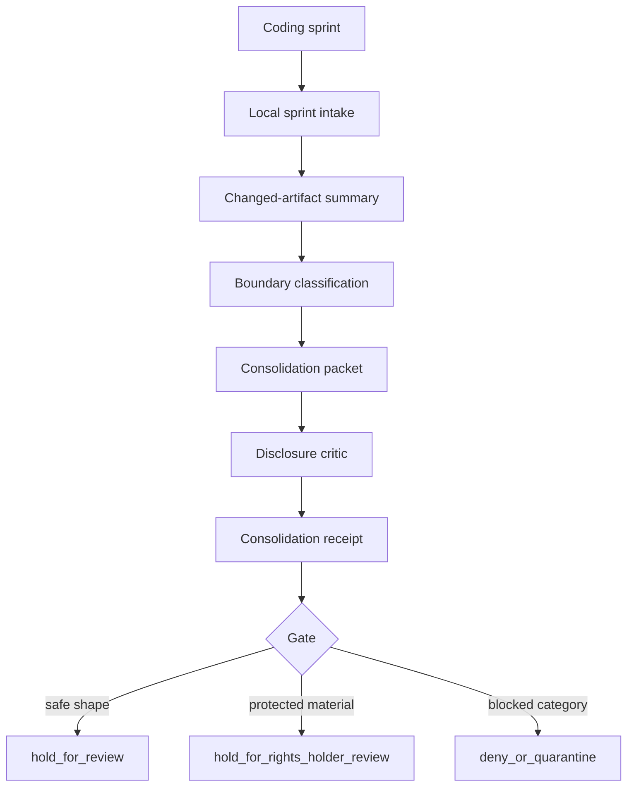

# Pipeline Connector Scope

Ontologica OS has a widened product scope: a local-first pipeline connector for consolidating complex coding-sprint sprawl into governed review packets.

This scope extends the product identity without converting the public repository into a production framework.

## Product Sentence

> Ontologica OS is a local ontology firewall and sprint-consolidation proofing lane for public-facing agentic architecture.

## Purpose

The pipeline connector helps a builder consolidate many coding sprints without letting raw sprint output become durable truth.

It turns sprint material into bounded review packets:

```text
coding sprint outputs
  -> local consolidation intake
  -> concept / artifact classification
  -> public vs protected boundary mapping
  -> synthetic proof packet
  -> disclosure critic
  -> consolidation receipt
  -> hold / review / deny
```

## What It Connects

The public concept may connect these local-only surfaces:

- sprint notes
- patch summaries
- changed-file manifests
- candidate design docs
- review comments
- proof packets
- disclosure critic receipts
- release review reports

## What It Must Not Expose

The public repository must not publish:

- private source code
- private branch strategy
- real worktree topology
- private automation instructions
- private routing
- private scoring or ranking
- production merge logic
- production release mechanics
- real private receipts
- real private manifests
- Tessera Ontologica private implementation details

## Consolidation Flow



## Packet Types

Public packet types may include:

- `sprint_summary_packet`
- `changed_artifact_packet`
- `public_vocabulary_packet`
- `protected_terms_packet`
- `disclosure_review_packet`
- `consolidation_receipt`
- `release_review_packet`

These are public vocabulary shapes only. They are not production schemas.

## Emphera Production Bridge

Emphera is treated here as a future production consolidation target outside this public repository.

Ontologica OS may produce local proofing packets that help decide what is safe to move toward Emphera.

It must not publish Emphera production implementation, production routes, private sprint data, private Tessera materials, or operational merge logic.

## Safe Bridge Shape

```text
private sprint material
  -> local Ontologica proofing lane
  -> consolidation packet
  -> disclosure critic receipt
  -> release review
  -> human-controlled Emphera intake
```

## Default Gate

All pipeline-connector outputs default to:

```text
authority_ceiling: candidate_only
decision: hold_for_review
promotion: none
```

## Future Rule

A future change may make the pipeline connector easier to understand.

A future change must be held for rights-holder review if it makes the connector production-capable, merge-capable, reconstructive of Tessera Ontologica, or able to promote sprint output without human review.
