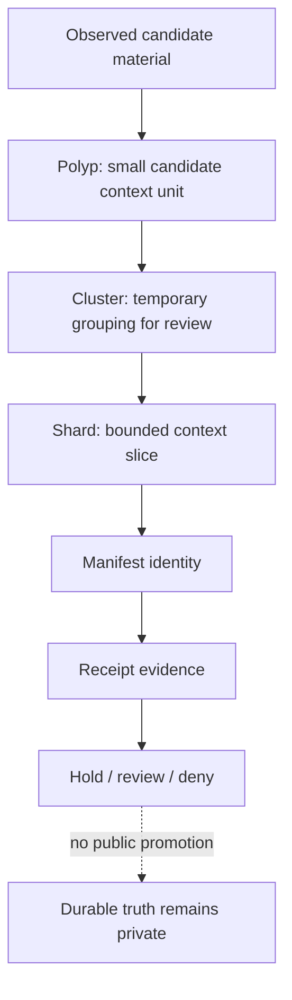
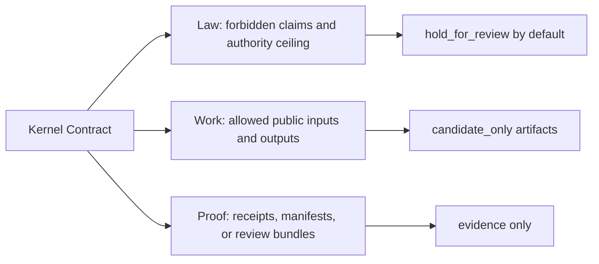
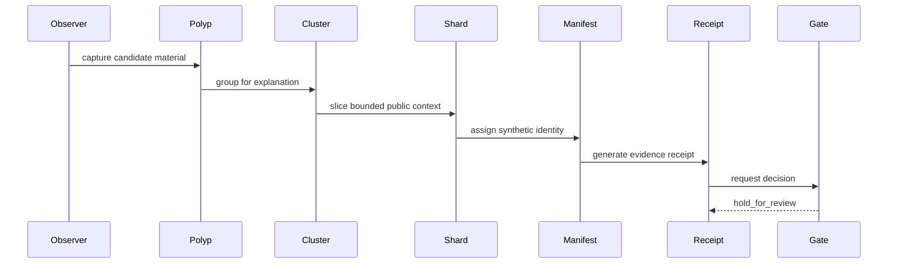

# Polyp, Cluster, and Shard Boundary

This document defines a public-facing vocabulary layer for polyp, cluster, and shard terminology.

The terms are postulated concepts for explaining bounded context movement. They are not private topology, not private routing logic, not production kernel logic, and not a grant of implementation rights.

## Public Intent

The public vocabulary may explain how candidate context can be grouped, reviewed, sliced, and receipt-bound without exposing the private machinery that decides those moves.

## Public Definitions

### Polyp

A polyp is a small candidate context unit. Publicly, it may be described as a bounded bundle of observed or proposed material that has not earned durable authority.

Allowed public framing:

- candidate-only context unit
- bounded observation or proposal bundle
- small reviewable packet
- synthetic fixture element

Protected private framing:

- exact private context schema
- private memory topology
- private scoring fields
- private routing triggers
- private lifecycle rules

### Cluster

A cluster is a temporary grouping of related candidate polyps. Publicly, it may be described as a review grouping that helps explain why several candidate units are considered together.

Allowed public framing:

- temporary candidate grouping
- review bundle
- similarity or adjacency metaphor
- synthetic grouping for demonstration

Protected private framing:

- production clustering algorithm
- private similarity metrics
- private thresholds
- private correlation logic
- private model-routing behavior

### Shard

A shard is a bounded context slice that may be manifest-identified and receipt-bound. Publicly, it may be described as a small, reviewable slice of candidate context.

Allowed public framing:

- bounded public context slice
- manifest-addressed demonstration artifact
- candidate-only review packet
- synthetic handoff example

Protected private framing:

- real shard topology
- private manifest lineage
- production shard selection logic
- private receipt graph structure
- runtime authority mapping

## Kernel Logic Surfacing Boundary

Public Ontologica OS may surface kernel logic only as Law / Work / Proof contracts.

It must not surface private implementation logic:

- private router code
- private selection heuristics
- private model assignment rules
- private scoring or ranking functions
- private graph topology
- private promotion heuristics
- real receipts or manifests

## Safe Public Process Shape

## Future Change Rule

A future change may clarify these terms with diagrams, examples, or synthetic fixtures.

A future change must be held for rights-holder review if it makes the terms operational, production-like, reconstructable, or capable of driving routing, scoring, clustering, promotion, memory writes, or runtime behavior.

The public repository may explain the shape of context movement, but it must not export the machinery of context movement.
