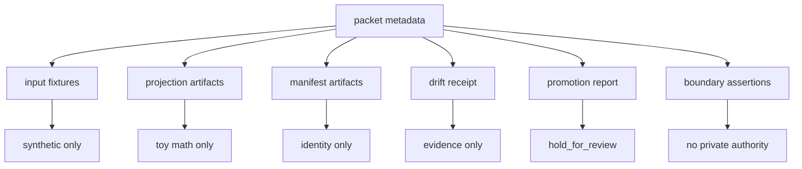
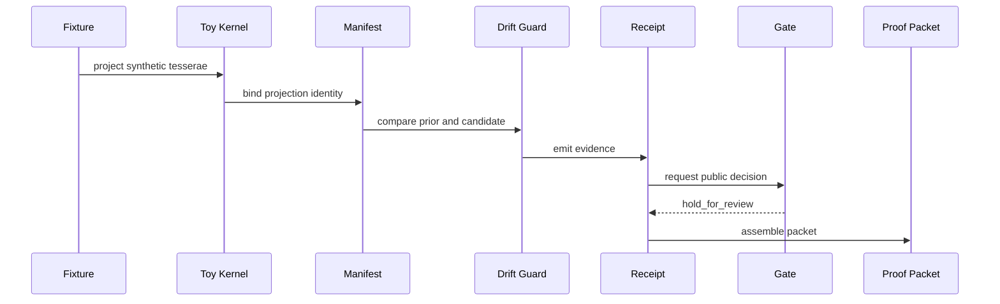

# Proof Packet Anatomy

A proof packet is a public, synthetic bundle that ties together the Ontologica OS proofing lane.

It is not a private receipt graph and not a production manifest format.

## Purpose

The proof packet answers one reviewer question:

> Can this public vocabulary form a coherent evidence path without claiming private authority?

## Public Packet Shape



## Required Sections

A public proof packet should include:

- `packet_id`
- `authority_ceiling`
- `status`
- `inputs`
- `projections`
- `manifests`
- `receipt`
- `gate_decision`
- `boundary_assertions`

## Authority Rules

```text
authority_ceiling: candidate_only
status: noncanonical
gate_decision: hold_for_review
private_lineage: none
runtime_authority: none
hardware_authority: none
```

## What Each Part Means

### Inputs

Inputs are synthetic fixtures. They are included so a reviewer can see what the toy proof lane consumed.

### Projections

Projections are outputs from the toy math kernel. They demonstrate deterministic shape, not private mathematical structure.

### Manifests

Manifests identify artifact content through synthetic SHA records. A SHA proves identity, not truth.

### Receipt

The receipt records drift evidence. It provides evidence, not promotion.

### Gate Decision

The public gate always holds or denies. It does not produce durable truth.

### Boundary Assertions

Boundary assertions state what the packet does not contain and does not authorize.

## Mermaid Sequence



## Rejection Test

A proof packet should be rejected or held for rights-holder review if it contains:

- real private manifests
- real receipt lineage
- private scoring
- private routing
- private math
- production validators
- runtime authority
- hardware authority
- durable-truth claims

## Current Demo Packet

The current synthetic packet is located at:

```text
sample_outputs/proofing_demo/proof_packet.json
```

It is a review aid, not a canonical artifact.
