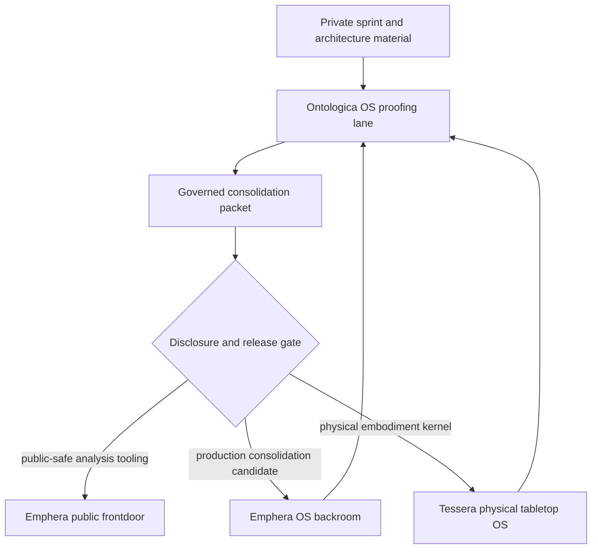

# Repository Structure Strategy

This document defines the intended repository roles across Ontologica OS, Emphera, Emphera OS, and Tessera.

The goal is to keep public explanation, analysis tooling, and physical embodiment kernels separated so each repository can mature without leaking the others' machinery.

## Strategic Split

```text
Ontologica OS
  proofing lane
  disclosure boundary compiler
  public/private vocabulary gate
  consolidation packet generator

Emphera
  public frontdoor
  complex branch-sprawl consolidation
  analysis-core tooling
  general data-analytics toolhouse

Emphera OS
  deeper operating layer for consolidation workflows
  production-adjacent orchestration candidate
  human-controlled intake from Ontologica packets

Tessera
  physical tabletop OS
  non-common embodiment kernels
  actuator and component governance
  hardware-adjacent proof and release posture
```

## Role Summary

| Repository | Primary role | Public posture | Protected material |
| --- | --- | --- | --- |
| Ontologica OS | Local disclosure proofing lane | Source-visible proof language and review packets | Private ontology, private scoring, private routing, private machinery |
| Emphera | Public analysis and branch-sprawl consolidation frontdoor | Starts public; presents public-safe analytics and consolidation tooling | Private sprint data, private routing, private merge logic |
| Emphera OS | Deeper operating layer for consolidation | Candidate backroom-to-frontdoor operating layer | Production orchestration, private workflow internals |
| Tessera | Physical tabletop OS | Private or tightly controlled embodied-system repository | Non-common kernels, actuators, hardware paths, physical embodiment logic |

## Frontdoor / Backroom Mapping



## Ontologica OS Responsibilities

Ontologica OS decides what can be safely said, packaged, or moved.

It may produce:

- public vocabulary packets
- protected-term reports
- consolidation packets
- proof packets
- disclosure critic receipts
- release review reports
- frontdoor/backroom routing recommendations

It must not produce:

- automatic promotion
- production merge decisions
- hardware actuation authority
- physical embodiment kernel code
- private analysis-core implementation
- private branch/worktree topology

## Emphera Responsibilities

Emphera is the public surface for complex branch-sprawl consolidation and general data analytics.

It may present:

- public dashboards
- public analytics vocabulary
- branch-sprawl summaries
- sprint consolidation reports
- public-safe review workflows
- data-tooling concepts

It must not directly publish:

- private Tessera embodiment kernels
- private Ontologica disclosure internals
- private sprint corpora
- private merge or promotion logic
- private branch/worktree topology

## Emphera OS Responsibilities

Emphera OS is the deeper operating layer for consolidation workflows.

It may receive human-reviewed candidates from Ontologica OS and Emphera.

It should not become public production authority until its own disclosure proofing lane, review packets, and release gates are established.

## Tessera Responsibilities

Tessera is the target home for the physical tabletop OS.

It consolidates the non-common kernels that drive physical embodiment, including hardware-adjacent actuator governance and component-specific control surfaces.

Tessera may contain:

- non-common embodiment kernels
- actuator governance
- physical component interfaces
- hardware proof posture
- tabletop runtime concepts
- safety gates for embodied action

Tessera must remain separated from Emphera public analytics and Ontologica public proof-language surfaces unless a public-safe packet is generated and reviewed.

## Movement Rules

### Backroom to Ontologica OS

Private material may enter a local Ontologica proofing lane only for review and packetization.

Default result:

```text
authority_ceiling: candidate_only
decision: hold_for_review
```

### Ontologica OS to Emphera

Only public-safe analytics, vocabulary, packet summaries, and frontdoor-ready concepts may move toward Emphera.

### Ontologica OS to Emphera OS

Only human-reviewed consolidation candidates may move toward Emphera OS.

### Ontologica OS to Tessera

Only private, rights-holder-approved physical embodiment kernel work may move toward Tessera.

No public Ontologica packet should grant actuator, hardware, or physical embodiment authority.

## Release Gate

Every movement between repositories requires:

```text
proof_packet: present
disclosure_critic: present
protected_terms_review: present
frontdoor_or_backroom_target: declared
human_review: required
final_gate: hold / review / deny
```

## Strategy Claim

The ecosystem should separate concerns this way:

```text
Ontologica OS decides what can be safely said.
Emphera shows public-safe analysis and consolidation tooling.
Emphera OS matures deeper consolidation workflows.
Tessera houses the physical tabletop OS and embodied kernels.
```
