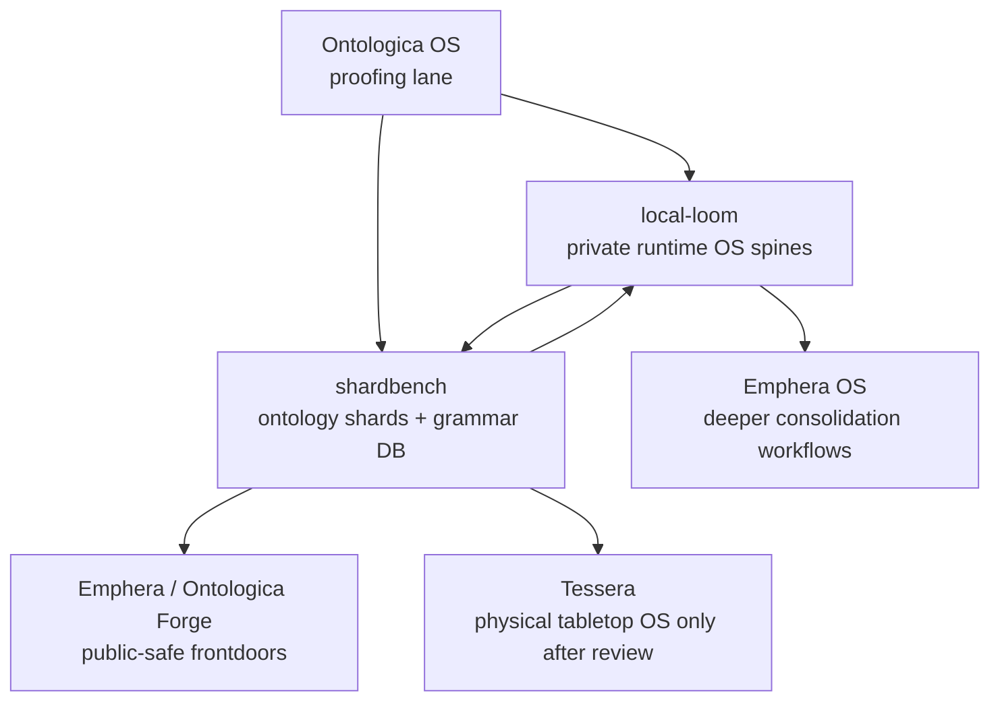

# Runtime Spine and Shard Kernel Strategy

This document adds `local-loom` and `shardbench` to the Ontologica OS landing-zone map.

## Role Additions

```text
local-loom
  private runtime OS spine lane
  local orchestration posture
  runtime integration candidates
  backroom execution-lane concepts

shardbench
  ontology shard storage
  grammar database workbench
  protected runtime-route records
  scars and pearls ledger
  shard movement proof posture
```

## Naming Note

`shardbuilder` was requested as a role name, but the current GitHub landing zone resolves to `shardbench`.

Until a dedicated `shardbuilder` repository exists, `shardbench` is treated as the current shard-builder landing zone.

## Conceptual Map



## local-loom Boundary

local-loom is private runtime-spine territory.

It may receive governed review packets, runtime-spine candidates, and local orchestration posture notes.

It must not grant production runtime authority, automatic promotion, uncontrolled execution machinery, hardware authority, or release authority without human review.

## shardbench Boundary

shardbench stores and reviews ontology shards, grammar surfaces, protected runtime-route records, scars, and pearls.

It may hold shard packets, grammar sketches, route records, scar receipts, pearl receipts, protected-term reports, and lineage summaries.

It must not publish private canonical shard stores, production grammar database exports, executable runtime-route machinery, private routing internals, real private manifests/receipts, or automatic runtime promotion.

## Movement Gate

Movement into or out of these repositories requires:

```text
proof_packet: present
disclosure_critic: present
protected_terms_review: present
source_repository: declared
target_repository: declared
human_review: required
final_gate: hold / review / deny
```

## Strategy Claim

The new split keeps runtime and knowledge-shard machinery out of public frontdoors:

```text
local-loom holds runtime-spine candidates privately.
shardbench stores ontology shards, grammar surfaces, routes, scars, and pearls.
Ontologica OS decides what can be safely said or moved.
```
