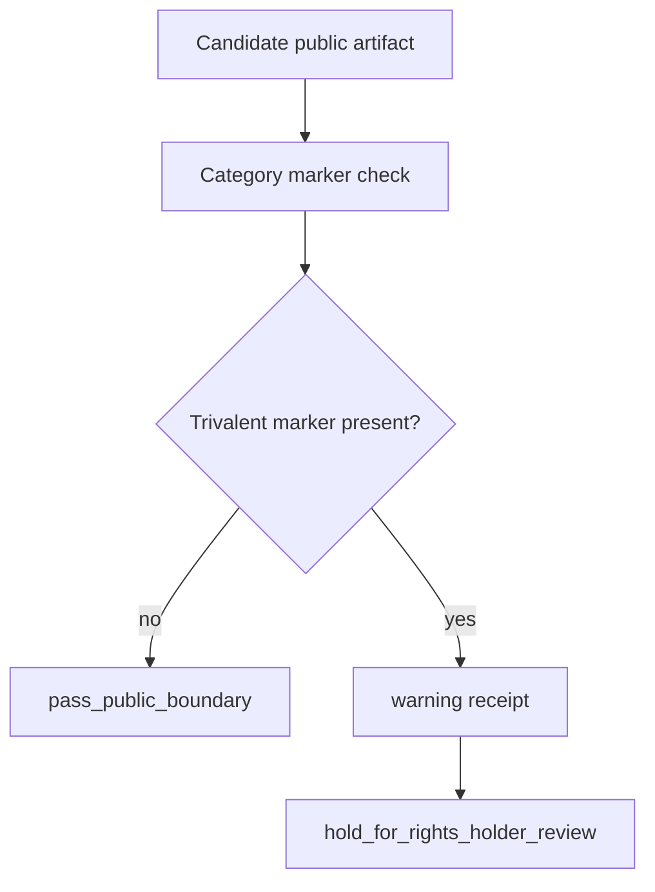

# Trivalent Boundary Warning

This document defines a public warning boundary for trivalent inner braid language.

Ontologica OS may name the phrase as a protected category marker. It must not explain how the private concept works.

## Public Rule

If a proposed public artifact tries to explain trivalent inner braid logic, the artifact should be held for rights-holder review.

Allowed public framing:

- category marker
- warning receipt
- `hold_for_rights_holder_review`
- `candidate_only`

Not public:

- how the logic works
- private rules
- private math
- private examples
- private use in a real system

## Public Guard Shape



## Receipt Shape

A public warning receipt should say:

```text
decision: hold_for_rights_holder_review
severity: warning
category: trivalent_inner_braid_public_boundary
authority_ceiling: candidate_only
```

## Maintainer Rule

The public repository may explain that this category exists as a boundary.

The public repository must not explain the protected concept itself.
