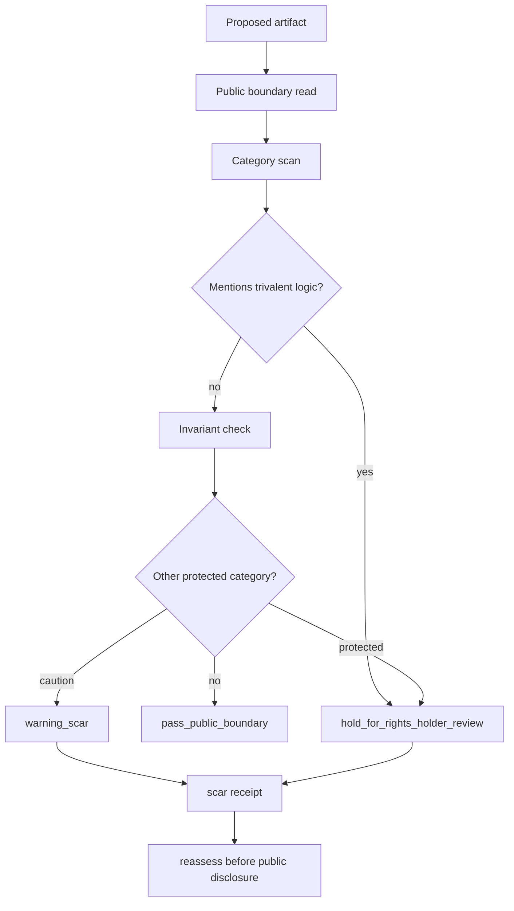

# Trivalent Inner Braid Boundary

This document defines a public, noncanonical self-audit posture for leak assessment.

It does **not** publish private trivalent logic, private scoring, private routing, private mathematical kernels, or production disclosure machinery.

## Purpose

The trivalent inner braid exists to test whether the repository can hold its own laws when a maintainer updates it.

It asks:

> Can a proposed public artifact be classified as safe or protected-hold without revealing the private logic that would make that assessment in a real system?

## Public Postures

The public repository may use only these qualitative postures:

```text
pass_public_boundary
  The artifact appears to stay within public vocabulary and proof posture.

warning_scar
  The artifact is not trivalent-specific, but it gestures toward a protected category and needs a durable caution receipt before any public release.

hold_for_rights_holder_review
  The artifact mentions trivalent logic or may expose protected categories or operational machinery. It must be held.
```

These are public review labels, not a private trivalent logic system.

## Hard Rule For Trivalent Logic

Any maintainer request that asks to expose, describe, implement, score, route, threshold, or operationalize trivalent logic must resolve to:

```text
posture: hold_for_rights_holder_review
authority_ceiling: candidate_only
scar_receipt: required
public_release: blocked_until_rights_holder_review
```

Category-level mention of trivalent logic is enough to leave a scar receipt. It is not enough to publish the logic.

## Public Braid Shape



## What Counts As Warning

The public braid may leave a warning scar for non-trivalent category-level references that do not include operational machinery.

Examples:

- category-level mention of private analysis core
- category-level mention of workspace topology
- category-level mention of atom serving
- category-level mention of receipt graph topology

A warning scar is not approval. It is a durable reminder to reassess before public disclosure.

## What Must Hold

The public braid must hold for rights-holder review when an artifact includes trivalent logic or operational machinery.

Examples:

- trivalent logic as a concept to disclose
- private trivalent rules
- exact scoring or thresholds
- real routing logic
- model assignment logic
- mathematical reconstruction path
- private receipt graph structure
- real branch/worktree topology
- atom database schema or serving code

## Scar Receipt

A scar receipt is a synthetic, noncanonical evidence artifact that records:

- artifact under review
- review posture
- public warning or hold category
- protected categories that remain undisclosed
- reason for hold or warning
- reassessment requirement

## Maintainer Rule

If documentation permits explanation but blocks implementation, leave a scar receipt instead of adding machinery.

If a future maintainer is unsure whether a concept is safe, choose:

```text
posture: hold_for_rights_holder_review
release_gate: reassess_before_public_disclosure
authority_ceiling: candidate_only
```

## Anti-Reconstruction Rule

The trivalent inner braid may name public postures. It must not publish the private trivalent logic that would score, route, threshold, weight, correlate, or promote artifacts in a production system.
