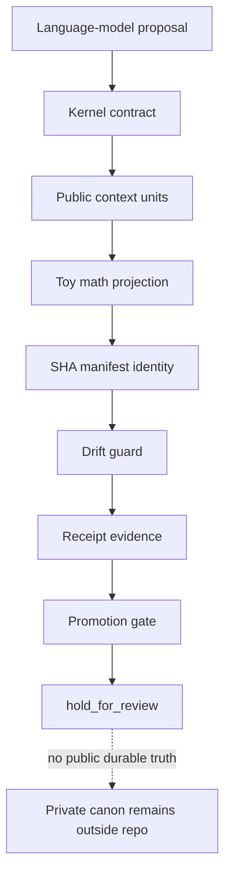
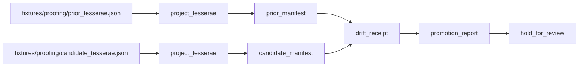
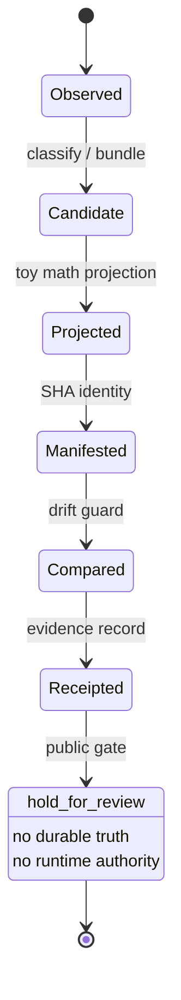
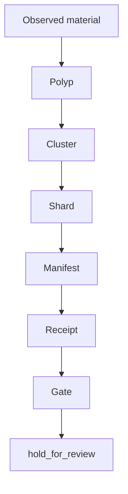
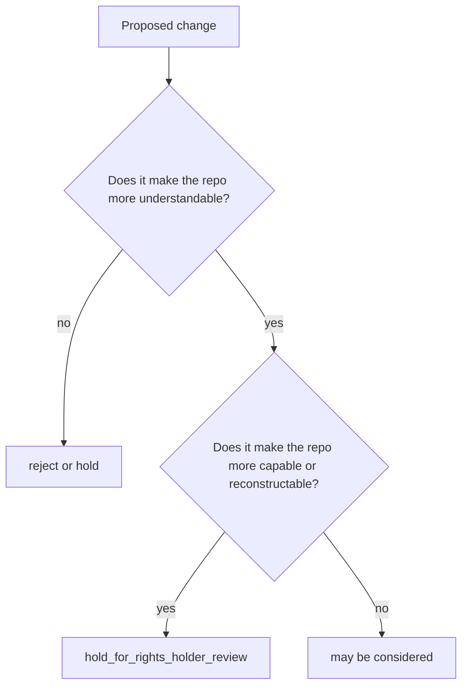

# V1 Conceptual Whole

Ontologica OS is a public conceptual whole, not a production framework.

It exists to make a bounded agentic proof posture legible without exporting private machinery.

## Core Claim

Ontologica OS demonstrates one public idea:

> Candidate cognition should move through bounded vocabulary, deterministic toy projection, manifest identity, drift receipt, and promotion hold before anyone treats it as durable truth.

## Public Concept Stack

## What Makes This More Than Documentation

The repository includes a runnable proofing lane, but the lane is intentionally small.

The proofing lane has enough substance to show process shape:

- source fixtures
- deterministic toy projection
- hash-bound projection identity
- toy manifest construction
- drift comparison
- receipt generation
- promotion hold
- tests around candidate-only behavior

It does not have enough capability to reconstruct private machinery.

## Public Lifecycle

## Public Context Movement

Polyp, cluster, and shard are public metaphors for context movement.

This diagram is explanatory only. It does not define private memory topology, routing logic, scoring, clustering, shard selection, manifest lineage, or receipt graph machinery.

## Boundary Delimiters

| Public surface | Protected private surface |
| --- | --- |
| vocabulary | private implementation |
| diagrams | production graph topology |
| toy fixtures | private traces |
| toy projections | production math kernels |
| synthetic manifests | real SHA lineage |
| synthetic receipts | real receipt graph |
| candidate-only reports | durable truth promotion |
| Law / Work / Proof contracts | private kernel routing |
| hold_for_review | runtime authority |

## Maintainer Decision Rule

## V1 Completeness Test

A reviewer should be able to answer:

1. What is the public idea?
2. What is a candidate artifact?
3. What is a kernel contract?
4. What is a toy math projection?
5. What does a manifest identify?
6. What drift is detected?
7. What does a receipt prove?
8. Why does the public gate hold instead of promote?
9. What is deliberately protected?

If those are clear, the public repo is not vaporware. If a reviewer can reconstruct private scoring, routing, math, lineage, or promotion logic, the public repo has gone too far.

## V1 Answer

Ontologica OS v1 should be evaluated as a public proof-language and proofing-lane demonstration.

It is valid if it shows the shape of disciplined agentic cognition.

It is invalid if it becomes a reusable agent framework, production analysis core, private math kernel, or authority-bearing runtime.
