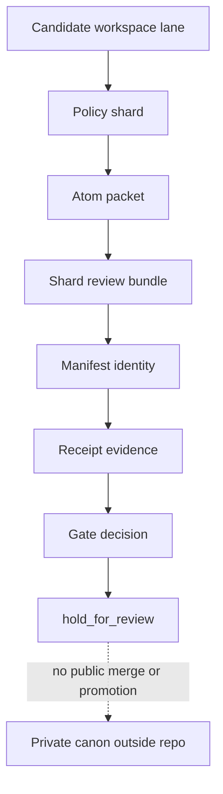
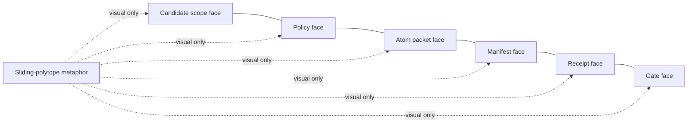
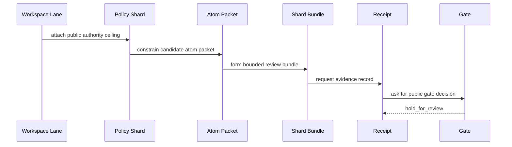

# Workspace, Policy Shard, and Atom-Serving Boundary

This document defines a public-facing vocabulary layer for git/workspace concepts, policy shards, atom packets, and the sliding-polytope metaphor.

These terms are explanatory only. They do not publish private workspace topology, branch strategy, policy engines, model routing, atom-serving infrastructure, mathematical kernels, or reconstruction paths.

## Decision

Public v1 may include these concepts when they are framed as policy vocabulary and review posture:

- workspace lane
- candidate workspace
- policy shard
- atom packet
- atom-serving boundary
- kinetic envelope
- sliding-polytope metaphor

Public v1 must not include operational machinery:

- real branch/worktree topology
- merge or coalescence rules
- private policy engines
- private routing logic
- atom database schemas
- production atom-serving code
- mathematical polytope representation
- thresholds, coordinates, weights, or geometry
- private receipt graph topology

## Public Shape

## Public Concepts

### Workspace Lane

A workspace lane is a public metaphor for an isolated review surface.

Allowed public framing:

- candidate review lane
- synthetic workspace posture
- bounded place where candidate artifacts are discussed
- explanatory link between a packet and a review gate

Protected private framing:

- real branch naming rules
- worktree topology
- merge strategy
- coalescence logic
- private CI gates
- release packaging rules

### Policy Shard

A policy shard is a small, portable statement of public authority boundaries.

Allowed public framing:

- candidate-only policy note
- Law / Work / Proof fragment
- authority ceiling reminder
- review constraint attached to a packet

Protected private framing:

- executable policy logic
- private routing policy
- model assignment rules
- promotion heuristics
- security controls
- production governance engine

### Atom Packet

An atom packet is a synthetic bundle of small public data references used to explain how candidate material may be served into a proof lane.

Allowed public framing:

- synthetic atom references
- small reviewable data packet
- candidate context payload
- demonstration-only fixture material

Protected private framing:

- private atom schema
- real atom store
- production data serving
- retrieval logic
- ranking logic
- private memory writes

### Kinetic Envelope

A kinetic envelope is a public metaphor for how a review boundary may move around candidate material.

Allowed public framing:

- a changing review window
- a candidate boundary that can shift from observe to hold
- a visual explanation of policy posture changing across a proof lane

Protected private framing:

- state-transition algorithm
- private scheduling logic
- private scoring or timing
- runtime authority motion
- production lifecycle rules

### Sliding-Polytope Metaphor

Sliding polytope is a metaphor only.

It may describe how several public boundary faces move together:

- candidate scope
- policy shard
- atom packet
- manifest identity
- receipt evidence
- gate decision

It must not describe mathematical geometry, coordinates, vectors, tensor layouts, dimensions, thresholds, transformations, or private kernel behavior.

## Metaphor Diagram

This diagram is not a mathematical model. It is a public visualization of coordinated boundary vocabulary.

## Agentic Ontology of Policy Exchange

Policy shards may be described as an agentic ontology only in the limited sense that they tell a worker what the public packet means.

The exchange is conceptual. It is not a runtime protocol, data-serving API, model-routing method, or production policy system.

## Safe Public Statement

Use this phrasing:

> Ontologica OS uses workspace lanes, policy shards, atom packets, and sliding-polytope diagrams as public metaphors for bounded candidate review. They explain how policy, context, identity, evidence, and gates move together without publishing private workspace mechanics, atom-serving infrastructure, or mathematical reconstruction paths.

## Future LLM Change Rule

A future maintainer or LLM may add diagrams, glossary entries, or synthetic fixtures that make these concepts easier to understand.

A future change must be held for rights-holder review if it makes these concepts operational, executable, measurable, routable, schedulable, reconstructable, or production-useful.

The public repository may explain coordinated boundary movement, but it must not export the machinery of workspace orchestration, policy exchange, atom serving, or geometric analysis.
